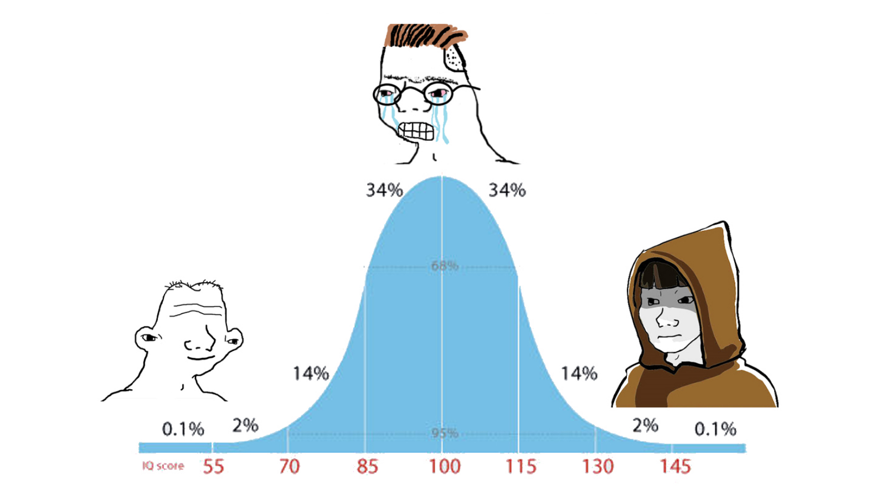

# Midwit Front-End

Live Deploy: [MidWit App](https://midwit-front-end.vercel.app/)

## The Maths

Your base score is calculated out of 20 questions. The calculation for your IQ is not accurate and obviously not your true IQ score. A traditional IQ test uses thousands and thousands of other test takers of the exact same test to get a point of reference for average, or an IQ of 100 shown on the bell curve below. As a result, the IQ score emitted on your NFT is completely arbitrary and not based on a true test. For our purposes, your score is calculated by multiplying your percent score (e.g. 65) by the median IQ score (100), and dividing by the average percent score (70). For example, the final calculation looks like: 65\*100 / 70 = 92 (truncated in solidity). With our test, a perfect score would emit a 142, so far from a perfect way to test IQ.

However, the true method to score IQ would be to divide your mental age by your chronological age, an example being 40/36, then multiply by 100. Essentially having a higher ratio of mental to chronological age emits a higher IQ. Your mental age is highly dependent on the test you take and how it compares to others your same age that took the same test.



## Running the Project

You can run this project by following these steps:

1. Clone the repo, change into the directory, and install the dependencies

```sh
git clone git@github.com:dabit3/lens-protocol-frontend.git

cd lens-interactions

npm install

# or

yarn
```

2. Run the project

```sh
npm run dev
```

3. Open the project in your browser at [localhost:3000](http://localhost:3000/)
